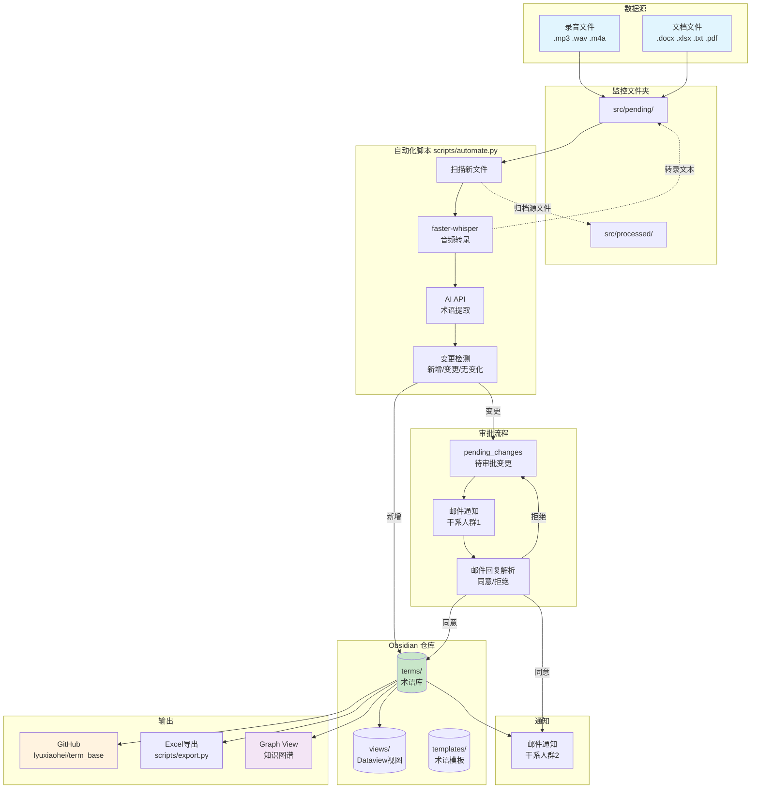

# 术语库项目架构

## 整体架构图



## 数据流

```
录音/文档 → src/pending/ → 转录 → AI提取术语 → 变更检测
                                                    ├── 新增 → terms/*.md → 自动push GitHub → 邮件通知群2
                                                    ├── 变更 → pending → 邮件通知群1审批
                                                    │                            ├── 同意 → terms/*.md → push → 邮件通知群2
                                                    │                            └── 拒绝 → 丢弃
                                                    └── 无变化 → 跳过
```

## 目录结构

```
term_base/                         ← Obsidian 仓库 + Git 仓库根目录
├── .gitignore                     ← 忽略规则（音频、配置、Obsidian缓存）
├── CLAUDE.md                      ← Claude Code 项目说明
├── .claude/skills/extract.md      ← /extract 技能定义
├── src/
│   ├── pending/                   ← 待解析文件 + 转录文本
│   └── processed/                 ← 已处理源文件归档
├── terms/                         ← 术语库（每条术语一个 .md）
│   ├── 积分卡.md                  ← 含 YAML frontmatter + 双链
│   ├── 运营中台.md
│   └── ...
├── templates/
│   └── 术语模板.md                ← 新建术语的模板
├── views/
│   ├── 首页.md                    ← 快速入口
│   ├── 术语总览.md                ← Dataview 全量表格 + 统计
│   ├── 按系统查看.md              ← 按业务系统分类
│   ├── 最近更新.md                ← 最近30条修改
│   └── 项目架构.md                ← 本文档
└── scripts/
    ├── automate.py                ← 自动化主脚本
    ├── config.json                ← 配置（AI/邮件/监控路径/干系人）— 不入库
    ├── state.json                 ← 运行状态（已处理文件/待审批）— 不入库
    └── export.py                  ← Excel 导出脚本
```

## 术语文件格式

```markdown
---
system: "所属系统"
source: "来源文件名"
created: "YYYY-MM-DD"
updated: "YYYY-MM-DD"
---

业务定义内容...

## 关联
- 上游：[[相关术语A]]
- 下游：[[相关术语B]]
- 相关：[[相关术语C]]
```

## 触发方式

| 方式 | 命令 | 说明 |
|------|------|------|
| 自动定时 | Windows 任务计划程序 | 每天 09:00 自动运行 |
| 手动运行 | `python scripts/automate.py --now` | 立即执行一次完整流程 |
| 交互式提取 | Claude Code `/extract` | 手动选择文件，对话式确认 |
| 导出 Excel | `python scripts/export.py` | 读取 terms/ 写入 xlsx |
| 注册定时任务 | `python scripts/automate.py --install` | 注册到 Windows 任务计划 |
| 移除定时任务 | `python scripts/automate.py --uninstall` | 从 Windows 任务计划移除 |

## 待配置项

编辑 `scripts/config.json`：

| 配置项 | 说明 | 示例 |
|--------|------|------|
| `monitor_dir` | 监控的录音文件夹路径 | `D:\\recordings` |
| `ai.api_key` | AI 服务 API Key | `sk-xxx` |
| `ai.base_url` | API 地址（兼容 OpenAI 格式） | `https://api.openai.com/v1` |
| `ai.model` | 模型名称 | `gpt-4o-mini` |
| `email.*` | SMTP/IMAP 邮箱配置 | — |
| `stakeholders.group1` | 术语口径变更审批人邮箱 | `["a@corp.com"]` |
| `stakeholders.group2` | 新增/更新术语通知人邮箱 | `["b@corp.com", "c@corp.com"]` |

## 同事使用方式

```bash
# 首次获取
git clone https://github.com/lyuxiaohei/term_base.git

# 用 Obsidian 打开 term_base 文件夹作为仓库

# 更新术语
git pull
```

安装 Obsidian 插件：
- **Dataview** — 表格视图（views/ 依赖）
- **Obsidian Git**（可选） — 自动 pull 最新术语
